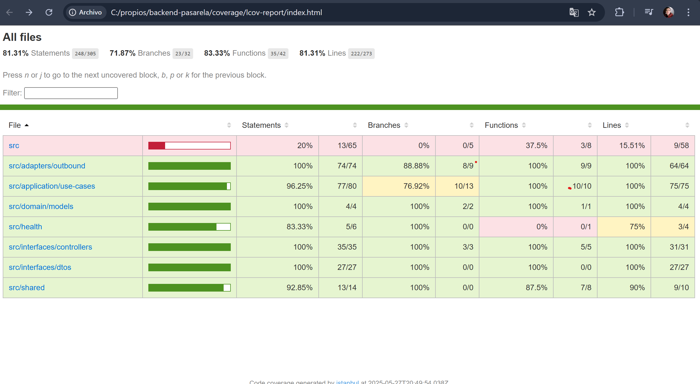

## Modelo de Datos

### Producto

| Campo        | Tipo    | Descripción                                         |
|--------------|---------|-----------------------------------------------------|
| `id`         | string  | Identificador único del producto (clave primaria)   |
| `nombre`     | string  | Nombre del producto                                  |
| `descripcion`| string  | Descripción del producto                             |
| `precio`     | number  | Precio unitario                                     |
| `stock`      | number  | Cantidad disponible en inventario                   |
| `imagen`     | string  | URL de la imagen del producto (opcional)            |

---

### Compra

| Campo              | Tipo    | Descripción                                                |
|--------------------|---------|------------------------------------------------------------|
| `id`               | string  | Identificador único de la compra (clave primaria)          |
| `productoId`       | string  | ID del producto comprado                                    |
| `cantidad`         | number  | Cantidad del producto comprado                              |
| `nombreCliente`    | string  | Nombre del cliente                                          |
| `direccion`        | string  | Dirección de entrega                                        |
| `estado`           | string  | Estado de la compra (`PENDIENTE`, `EXITOSA`, `FALLIDA`)    |
| `total`            | number  | Total a pagar (producto + tarifas)                          |
| `fechaCreacion`    | string  | Fecha y hora de creación                                    |
| `fechaActualizacion`| string | Fecha y hora de la última actualización                     |

### Entregas

| Campo              | Tipo    | Descripción                                                |
|--------------------|---------|------------------------------------------------------------|
| `productoId`       | string  | ID del producto comprado (clave primaria)                   |
| `cantidad`         | number  | Cantidad del producto comprado                              |
| `nombreCliente`    | string  | Nombre del cliente                                          |
| `direccion`        | string  | Dirección de entrega                                        |
| `telefono`         | string  | Telefono del cliente                                        |
| `email`            | string  | Email del cliente                                           |
| `total`            | number  | Total a pagar (producto + tarifas)                          |

### Clientes

| Campo              | Tipo    | Descripción                                                |
|--------------------|---------|------------------------------------------------------------|
| `id`               | string  | Identificador único del cliente  (clave primaria)          |
| `nombre`           | string  | Nombre del cliente                                          |
| `direccion`        | string  | Dirección de entrega                                        |
| `telefono`         | string  | Telefono del cliente                                        |
| `email`            | string  | Email del cliente                                           |
| `fechaCreacion`    | string  | Fecha de creacion del cliente                               |

## Swagger Api
https://b67wpwmrik.execute-api.us-east-1.amazonaws.com/dev/api

## Cobertura Test
